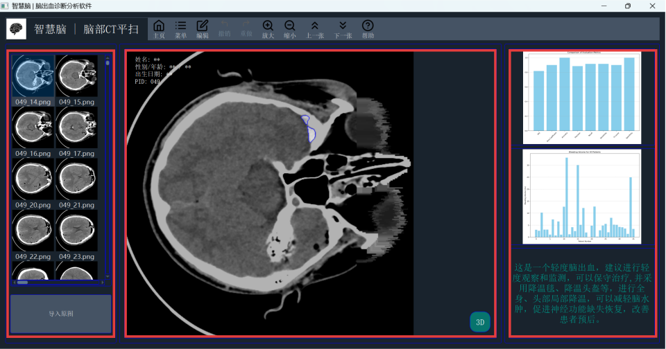

# 智慧脑 | 脑出血诊断分析软件
*Brain Hemorrhage Diagnosis Assistance Software*

本项目为脑出血辅助诊断软件，基于 Python 和 PyQt5 开发。可以快速加载脑部 CT 平扫图像，显示预测分割结果，并支持手动勾画、撤销/重做、缩放等功能。  

主界面分为三部分：

*   **左侧面板**：图像导入与缩略图列表
*   **中间面板**：CT 图像显示与编辑，左上角显示病人信息（PID），右下角可生成 3D 出血模型
*   **右侧面板**：诊断结果与分析

以下是界面布局示意图：



---

## 功能概览

1. **图像管理**
   - 导入图像文件夹（支持 PNG、JPG、JPEG、BMP、GIF）。
   - 显示缩略图列表，点击可在中间面板查看对应图像。
   
2. **图像显示与编辑**
   - 支持图像缩放和拖动。
   - 编辑模式下可用鼠标左键绘制红色标记。
   - 撤销/重做功能，最多支持 20 步历史记录。
   - 支持 Ctrl + 滚轮 快速缩放图像。
   - 双击诊断图表可放大查看高清图表。
   - 左上角自动显示 病人信息（PID）。
   
3. **诊断结果**
   - 显示评估指标图（IOU、Dice 系数、准确率等）。
   - 显示出血量图及数值。
   - 自动生成轻度/中度/重度诊断参考。
   
4. **帮助文档**
   - 内置帮助文档，包含使用指南与界面说明。

---

## 依赖环境

- Python 3.8+
- PyQt5
- numpy
- opencv-python
- matplotlib
- qdarkstyle（可选，用于美化界面）

安装依赖示例：

```bash
pip install pyqt5 numpy opencv-python matplotlib qdarkstyle
```

---

## 快速启动

```bash
python windowmain.py
```
启动后即可进入主界面，导入病例图像并进行诊断分析。

---

## 注意事项

- 确认 data/predict 和 data/mask 目录下有对应的预测结果和掩码文件。
- 支持常见图像格式（PNG、JPG、BMP、GIF）。
- 高分辨率图像较多时，加载可能有轻微延迟。
- 提示：本软件为研究与教学用途，结果仅供参考，最终诊断需由专业医生确认。
